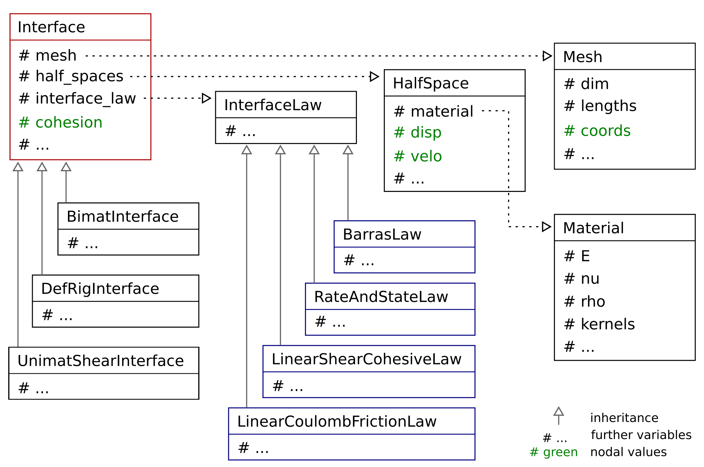

Developer's Guide
=================

Code architecture
-----------------

The key classes for uguca are schematically illustrated in the following figure

The central class is the ``Interface`` class. It contains the ``Mesh``, the one or two ``HalfSpaces``, the ``InterfaceLaw`` governing the failure, and the ``cohesion`` nodal array. It contains further members, but we only highlight the key members here. ``Interface`` is an abstract class. The developer needs to inherit from it in order to implement a specific interface behavior (see below). Various types of interfaces have been implemented.

The ``Mesh`` contains the discretization of the interface. Hence, it is defined by the spatial dimension ``dim``, which could be 2 or 3. Further, it has lengths indicating the size of the interface, and ``coords``, which are the coordinates of the nodes.

The ``HalfSpace`` object represents an elastic half-space. Hence, it contains a ``Material``, and the displacement ``disp``, and velocity ``velo`` nodal values of the boundary of the half-space.

The ``Material`` contains the elastic properties, including the elastic modulus ``E``, the Poisson's ratio ``nu``, density ``rho``, and the precomputed ``kernels``.

The ``InterfaceLaw`` is the constitutive law describing the evolution of the cohesion along the interface. It is an abstract class, from the developer needs to inherit in order to implement a specific interface law (see below). Various interface laws have been implemented and it is straight forward to implement additional interface laws.

Coding conventions
------------------

We adopt the following coding conventions:

**Comment**: briefly describe code and algorithms

**Indent style**: `K&R <https://en.wikipedia.org/wiki/Indentation_style#K&R_style>`_ with 2 space tab

**Naming**:

- all methods begin with a verb or command and use (lower) `camelCase <https://en.wikipedia.org/wiki/Camel_case>`_

- all class names are UpperCamelCase

- all members are `snake_case <https://en.wikipedia.org/wiki/Snake_case>`_

Develop interface law
---------------------

A new constitutive interface law needs to inherit from the ``InterfaceLaw`` class. Aside from the standard constructor, destructor, and accessors, it has to implement the ``computeCohesiveForces`` method.

An example is provided here:

.. literalinclude:: ../../../doc/dev-doc/src/example_law.hh
   :language: cpp

with the implementation give by:

.. literalinclude:: ../../../doc/dev-doc/src/example_law.cc
   :language: cpp

The ``computeCohesiveForces`` method typically computes the strength of the interface as function of for example the displacement discontinuity at the interface (*i.e.* the gap) or its temporal derivatives.
Then it compares the computed strength with the traction needed to close the gap or maintain it constant.
This tractions can be computed by the interface by calling the methods ``closingNormalGapForce``, or ``maintainShearGapForce``.

The ``registerDumpField`` method simply sets up the dumper to account for interface law specific fields.

Develop interface type
----------------------

A new type of interface needs to inherit from the ``interface`` class. Aside from the standard constructor, destructor, and accessors, it has to implement the following methods:

- ``closingNormalGapForce``

- ``maintainShearGapForce``

- ``computeGap``

- ``computeGapVelocity``

- ``registerDumpField``

An example is provided here:

.. literalinclude:: ../../../doc/dev-doc/src/example_interface.hh
   :language: cpp
	      
with the implementation give by:

.. literalinclude:: ../../../doc/dev-doc/src/example_interface.cc
   :language: cpp

Most problems can be solved by using the ``bimaterialInterface``. However, one can take advantage of symmetries and properties of a given problem to decrease computational cost by 50% by modeling only one half space.
For example, if top material is order of magnitude stiffer than the bottom material, it can be assumed to be rigid (for deformable - rigid interface see the ``DefRigInterface`` class).
These assumptions need to be taken into account when implementing the methods of the specific interface.

